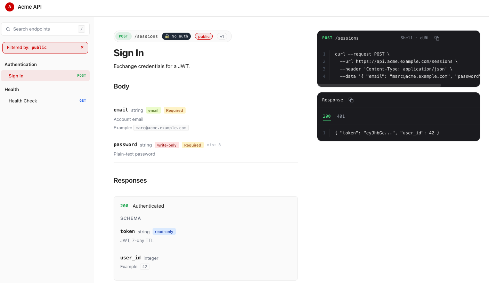

# rails-api-docs

Generate beautiful API documentation for your Rails app — two outputs from
one editable YAML:

- **Live preview in development.** Visit `http://localhost:3000/rails/api-docs`
  and the page re-renders from `config/rails-api-docs.yml` on every refresh.
  Edit the YAML in one window, hit F5 in the other — no build step while
  iterating.

- **Self-contained HTML for production.** `rake rails-api-docs:build` writes
  `public/api-docs.html`: a single file with all CSS and JS inlined. Drop it
  on any static host — no asset pipeline, no JavaScript runtime.

The gem inspects your routes, controllers (via Prism AST), and
`ActiveRecord` schema to scaffold the YAML on first run; you edit it from
there to add descriptions, examples, and constraints.



---

## Installation

Requires Ruby ≥ 3.1 and Rails ≥ 7.1.

```ruby
# Gemfile
group :development do
  gem "rails-api-docs"
end
```

```bash
bundle install
```

## Quick start

```bash
# 1. Scaffold the YAML config from your current routes
#    (use --api-only to include only routes that return JSON)
#    (use --verbose-yaml to emit every possible key with defaults)
rails g rails-api-docs:init

# 2. Run the server
rails server
```

In development access live view at `/rails/api-docs `

For production build the the static HTML

```bash
rake rails-api-docs:build
```

## The workflow

The flow is designed around **two artifacts** that you commit:

| File                        | Role                                     | Edited by                   |
| --------------------------- | ---------------------------------------- | --------------------------- |
| `config/rails-api-docs.yml` | source of truth — descriptions, examples | **you**                     |
| `public/api-docs.html`      | rendered output                          | `rake rails-api-docs:build` |

The YAML is the only file you maintain by hand. The HTML is regenerated
from it (and from your routes, when you re-run the generator).

### Updating the YAML

After adding new routes to your Rails app, run:

```bash
rails g rails-api-docs:update
```

It scans your routes and **appends only what's new** to
`config/rails-api-docs.yml`. Existing entries are never modified, so the
descriptions, examples, body fields and section names you've edited
survive every re-run.

To regenerate a single route with fresh inferred defaults, delete it
from the YAML and run `:update` again.

All flags (`--api-only`, `--only-controllers`, etc.) are accepted.

> ⚠️ **Caveat about comments inside the YAML:** the gem re-emits the
> entire YAML file in append-only mode using `YAML.dump`, which preserves
> values but not free-form comments _inside_ the file. The leading
> `#`-comment block at the top of the file (your notes + the gem header)
> **is** preserved.

## YAML structure

Only `method` and `path` are required on each endpoint. Everything else
is optional and has sensible defaults. Endpoint identity for the
append-only merge is `"#{method} #{path}"`.

### Complete reference

```yaml
general_configurations:
  title: "My App API"
  base_url: "https://api.example.com"
  primary_color: "#CC0000"
  secondary_color: "#2E2E2E"
  accent_color: "#D30001"
  font_family: "system-ui, -apple-system, sans-serif"
  show_curl: true
  show_examples: true

sections:
  users: # controller path (stable key)
    name: "Users"
    description: "User account endpoints"
    show: true
    endpoints:
      - method: POST # required
        path: /users # required
        name: "Create User"
        description: "Register a new user account."
        show: true

        # ── endpoint metadata ──
        deprecated: false
        auth: bearer # bearer | basic | none | <custom>
        tags: [public, auth]

        # ── request side ──
        headers:
          - name: Authorization
            type: string
            required: true
            description: "Bearer token"
            example: "Bearer eyJhbGciOi…"
          - name: X-Idempotency-Key
            type: string
            required: false

        params:
          - name: id
            type: integer
            in: path # path | query
            required: true
            example: 42

        body:
          - name: email
            type: string
            required: true
            format: email # email | uuid | uri | date-time | …
            example: "marc@example.com"
            description: "Unique email address."
          - name: password
            type: string
            required: true
            write_only: true
            min_length: 8
            max_length: 72
          - name: role
            type: string
            enum: [user, admin, guest]
            default: user
          - name: age
            type: integer
            nullable: true
            min: 0
            max: 150
          - name: zip
            type: string
            pattern: "^\\d{5}$"

        request_example: |
          { "user": { "email": "marc@example.com", "password": "i-love-rails" } }

        # ── response side ──
        responses:
          "201":
            description: "User created"
            headers:
              - name: Location
                type: string
                example: "https://api.example.com/users/42"
            schema:
              - { name: id, type: integer, read_only: true }
              - { name: email, type: string, format: email }
              - {
                  name: token,
                  type: string,
                  read_only: true,
                  description: "JWT, 7-day TTL",
                }
            example: |
              { "id": 42, "email": "marc@example.com", "token": "eyJ..." }
          "422":
            description: "Validation failed"
            example: '{ "errors": { "password": ["too short"] } }'
```

### Top-level keys

| Key                      | Type | Default | Purpose                                                       |
| ------------------------ | ---- | ------- | ------------------------------------------------------------- |
| `general_configurations` | hash | `{}`    | Global config — title, base URL, theme colors, render toggles |
| `sections`               | hash | `{}`    | All documented routes, keyed by controller path               |

### `general_configurations` keys

| Key               | Type       | Default                     | Purpose                                                      |
| ----------------- | ---------- | --------------------------- | ------------------------------------------------------------ |
| `title`           | string     | `"API Documentation"`       | Top-bar text + browser tab title                             |
| `base_url`        | string     | `"https://api.example.com"` | URL prefix used in the generated cURL command                |
| `primary_color`   | CSS color  | `"#CC0000"`                 | Maps to CSS `--primary` — sidebar active state, brand circle |
| `secondary_color` | CSS color  | `"#2E2E2E"`                 | Maps to CSS `--secondary` — dark UI accents                  |
| `accent_color`    | CSS color  | `"#D30001"`                 | Maps to CSS `--accent` — reserved for future use             |
| `font_family`     | CSS string | system stack                | Body font of the rendered page                               |
| `show_curl`       | bool       | `true`                      | Whether to render the cURL block in column 3                 |
| `show_examples`   | bool       | `true`                      | Whether to render the response example block in column 3     |

### Section keys

A section's key (`users`, `api/v1/posts`) is the **controller path** — the same string Rails uses internally. It's the stable identifier for the append-only merge, so don't rename it.

| Key           | Type   | Default                    | Purpose                                              |
| ------------- | ------ | -------------------------- | ---------------------------------------------------- |
| `name`        | string | controller name, humanized | Display label in the sidebar                         |
| `description` | string | `""`                       | Currently unused by the renderer (reserved)          |
| `show`        | bool   | `true`                     | Set `false` to hide the entire section from the docs |
| `endpoints`   | array  | `[]`                       | List of endpoint hashes (see below)                  |

### Endpoint keys

| Key               | Type            | Default              | Purpose                                                                                                                                                      |
| ----------------- | --------------- | -------------------- | ------------------------------------------------------------------------------------------------------------------------------------------------------------ |
| `method`          | string          | **required**         | HTTP verb (`GET`, `POST`, `PATCH`, …)                                                                                                                        |
| `path`            | string          | **required**         | URL path (`/users/:id`). Combined with `method` for identity                                                                                                 |
| `name`            | string          | inferred from action | Display label (sidebar + page heading)                                                                                                                       |
| `description`     | string          | `""`                 | Lead paragraph under the heading                                                                                                                             |
| `show`            | bool            | `true`               | Set `false` to hide this endpoint individually                                                                                                               |
| `deprecated`      | bool            | `false`              | Red "Deprecated" badge + strikethrough on the title                                                                                                          |
| `auth`            | string          | none                 | `bearer` / `basic` / `none` / custom. Adds a dark badge in the header. Auto-injects an `Authorization` placeholder into cURL when not declared in `headers:` |
| `tags`            | array           | `[]`                 | Clickable chips next to the method pill — click to filter the sidebar to endpoints with that tag. See [Tag filtering](#tag-filtering)                        |
| `headers`         | array of fields | `[]`                 | Request headers — rendered as a "Headers" section AND injected into cURL                                                                                     |
| `params`          | array of fields | `[]`                 | Path & query params (`in: path` / `in: query`)                                                                                                               |
| `body`            | array of fields | `[]`                 | Request body fields                                                                                                                                          |
| `request_example` | string          | inferred             | Raw body shown in `curl --data`. Wins over the auto-generated sample                                                                                         |
| `responses`       | hash            | `{}`                 | Per-status responses, keyed by HTTP status code (string keys: `"201"`, `"422"`)                                                                              |

### Tag filtering

Tags double as a **category filter** in the rendered docs. Add them under
any endpoint:

```yaml
endpoints:
  - method: POST
    path: /users
    tags: [public, auth]
  - method: POST
    path: /admin/users
    tags: [admin, auth]
  - method: GET
    path: /health
    tags: [public]
```

How they behave in the live preview AND the built `public/api-docs.html`
(same JS runs in both):

- **Display.** Each tag is a small pill next to the method pill in the
  endpoint header.
- **Click to filter.** Click any tag → the sidebar collapses to only
  endpoints carrying that tag. The clicked pill highlights in the
  primary color across every endpoint page.
- **Toggle.** Click the same tag again → filter clears.
- **Switch.** Click a different tag → switches to that one (single-tag
  exclusive; no multi-select).
- **Combine with search.** Tag filter and the search box compose with
  AND — only items matching both stay visible.
- **Clear indicator.** When a tag is active, a pill appears between the
  search box and the section list: `Filtered by: auth ×`. Click the ×
  (or the active tag again) to clear.

Anything works in `tags` — strings with spaces, special characters,
versions like `v1`/`beta`. They're JSON-encoded internally on the
sidebar `<li>` so quoting never breaks.

Accessibility: tags render as real `<button>` elements (Tab-navigable,
Enter/Space activates) with `aria-pressed` reflecting the toggle state.
The active-filter pill uses `aria-live="polite"` so screen readers
announce changes.

### Field keys

Used uniformly by `body`, `params`, `headers`, and `responses["XXX"].schema`. Only `name` is required.

| Key           | Type    | Default      | Purpose                                                                     |
| ------------- | ------- | ------------ | --------------------------------------------------------------------------- |
| `name`        | string  | **required** | Field name                                                                  |
| `type`        | string  | `string`     | Logical type (`string`, `integer`, `boolean`, `date`, `array`, `object`, …) |
| `required`    | bool    | `false`      | Adds yellow "Required" badge                                                |
| `description` | string  | none         | Subtle line under the field row                                             |
| `example`     | any     | none         | "Example: `value`" line under the description                               |
| `format`      | string  | none         | Green badge (`email`, `uuid`, `uri`, `date-time`, `ipv4`, …)                |
| `enum`        | array   | none         | Renders "one of: `a` · `b` · `c`"                                           |
| `default`     | any     | none         | Meta badge — even `false`/`0` are shown                                     |
| `min`         | numeric | none         | Meta badge `min: N` (numeric values)                                        |
| `max`         | numeric | none         | Meta badge `max: N`                                                         |
| `min_length`  | integer | none         | Meta badge `min: N` (string length)                                         |
| `max_length`  | integer | none         | Meta badge `max: N` (string length)                                         |
| `pattern`     | string  | none         | Monospace `pattern: …` meta                                                 |
| `read_only`   | bool    | `false`      | Blue badge                                                                  |
| `write_only`  | bool    | `false`      | Red badge                                                                   |
| `nullable`    | bool    | `false`      | Italic gray badge                                                           |
| `in`          | string  | none         | Indigo badge — typically `path` or `query`, used on `params` entries        |

### Response keys

Each entry in `responses` is keyed by HTTP status code (as a **string**, quote the YAML key) and accepts:

| Key           | Type            | Default              | Purpose                                                                    |
| ------------- | --------------- | -------------------- | -------------------------------------------------------------------------- |
| `description` | string          | `""`                 | Shown next to the status code in the central column                        |
| `example`     | string          | inferred from `body` | Raw body shown in the response tab (right column). Used by the copy button |
| `headers`     | array of fields | `[]`                 | Response headers — rendered as field rows under a "Headers" subhead        |
| `schema`      | array of fields | `[]`                 | Typed response fields — rendered as field rows under a "Schema" subhead    |

### What gets inferred automatically

| Source                       | Filled into the YAML                                                             |
| ---------------------------- | -------------------------------------------------------------------------------- |
| `Rails.application.routes`   | section keys, method, path, action-based endpoint name                           |
| Path itself (`:id`, `:slug`) | `params: [{ in: path, type, required: true }]` — type heuristic: `_id` → integer |
| Controller (Prism AST)       | `body:` field names from `params.permit(:a, :b, …)` patterns                     |
| ActiveRecord `columns_hash`  | `type` and `required` (NOT NULL + no default) for each inferred body field       |

Every body field, path param, and response stub is also seeded with
`description: ""` and `example: <type-sample>` so you can customize values
without having to remember key names. The `example` value flows into the
generated cURL command and the default response block — change it once,
both reflect.

Advanced field keys (`format`, `enum`, `default`, `min`/`max`,
`min_length`/`max_length`, `pattern`, `read_only`/`write_only`,
`nullable`) and endpoint-level keys (`deprecated`, `auth`, `tags`,
`headers`, `request_example`) stay opt-in to keep the YAML lean. Pass
`--verbose-yaml` to emit them all with defaults for full discoverability:

```bash
rails g rails-api-docs:init --verbose-yaml
rails g rails-api-docs:update --verbose-yaml
```

Persist as the default:

```ruby
RailsApiDocs.configure { |c| c.verbose_yaml = true }
```

Combines freely with other flags — the two operate on different pipeline
stages (`--api-only` filters which routes are included, `--verbose-yaml`
controls how each included route is rendered):

```bash
rails g rails-api-docs:init --api-only --verbose-yaml
```

## Customization

### Colors and labels

Edit `general_configurations`. The colors are wired straight into CSS
variables (`--primary`, `--secondary`, `--accent`) at render time, so a
single value change re-themes the whole page.

### Filtering routes

Add an initializer in your Rails app:

```ruby
# config/initializers/rails_api_docs.rb
RailsApiDocs.configure do |c|
  c.ignored_path_prefixes = ["/admin", "/internal"]
  c.ignored_controllers   = [/^devise\//, "health"]
  c.ignored_actions       = %w[new edit]   # typical for JSON APIs
end
```

These are applied at `rails g rails-api-docs:init` time (and at the
dev `/rails/api-docs` mount). Built-in Rails internals
(`/rails/info`, `/rails/active_storage`, etc.) and routes without a
controller (engine mounts, lambdas) are always skipped.

`ignored_controllers` and `only_controllers` (below) share the same
matching rule:

- **Regexp** → standard regex match.
- **String with `/`** → exact path match. `"api/v1/users"` only matches
  that exact controller.
- **String without `/`** → boundary-aware suffix match. `"users"` matches
  both `users` and `api/v1/users`, but NOT `super_users` or `users_admin`.

### Scaffolding only specific controllers (`--only-controllers`)

Whitelist by controller name. Four CLI forms are accepted — pick whichever
feels natural:

```bash
# Space-separated (Thor native — usually the most ergonomic)
rails g rails-api-docs:init --only-controllers users posts comments

# Comma-separated
rails g rails-api-docs:init --only-controllers=users,posts,comments

# Bracketed
rails g rails-api-docs:init --only-controllers=[users,posts,comments]

# Namespaced exact-path
rails g rails-api-docs:init --only-controllers api/v1/users api/v1/posts
```

Bare names match across namespaces (e.g. `users` keeps both `users` and
`api/v1/users`); slash-qualified names are exact.

When both `only_controllers` and `ignored_controllers` apply to the same
controller, the **blacklist wins** — natural read: "include only these,
except the ones I explicitly excluded".

Combine with `--api-only` for the intersection:

```bash
rails g rails-api-docs:init --only-controllers users orders --api-only
```

Persist as a default:

```ruby
RailsApiDocs.configure do |c|
  c.only_controllers = %w[users posts api/v1/widgets]
  # or mix strings and regexps
  c.only_controllers = [/^api\/v1\//, "users"]
end
```

The CLI flag wins when both are set. Repeating the flag (e.g.
`--only-controllers users --only-controllers posts`) **does not** merge —
Thor takes the last one. Always pass all names in a single flag.

### Scaffolding only JSON-returning routes (`--api-only`)

```bash
rails g rails-api-docs:init --api-only
```

Includes a route in the YAML only if the gem can prove it returns JSON:

1. **Controller-level:** the controller's inheritance chain (followed via
   Prism AST through `ApplicationController` / any custom base) reaches
   `ActionController::API`. Whole controller is considered JSON.
2. **Action-level:** the specific action body contains a literal
   `render json: …` (kwarg or hash-rocket form), including inside
   `respond_to { |f| f.json { render json: … } }` blocks.

Anything we can't statically classify as JSON is **excluded** (strict).
That keeps the YAML clean even when your app has Devise, RailsAdmin, or
HTML controllers mixed in.

Persist it as the default in an initializer:

```ruby
RailsApiDocs.configure { |c| c.api_only = true }
```

The CLI flag wins when both are set — pass `--no-api-only` to override
the config for a single run.

> Append-only doctrine still applies: filtering happens at scaffold time,
> not at render time. Re-running with `--api-only` after you've already
> got HTML routes in the YAML won't remove them — delete them by hand if
> needed.
>
> **Known gaps:** `render json:` called from a helper method (we don't
> follow method calls), `render template: "x", formats: :json` (no
> `json:` key), and includes (`include SomeRenderingModule`) are not
> traversed.

### Disabling the dev mount

```ruby
RailsApiDocs.configure { |c| c.mount_in_development = false }
```

### Custom paths

```ruby
RailsApiDocs.configure do |c|
  c.config_path = "doc/api.yml"
  c.output_path = "public/docs/index.html"
  c.mount_path  = "/internal/api-docs"
end
```

Or per-build via env vars:

```bash
rake rails-api-docs:build CONFIG=doc/api.yml OUTPUT=public/docs/index.html
```

## The dev mount: `/rails/api-docs`

When `Rails.env.development?` the engine appends a `mount` for itself at
`/rails/api-docs` (configurable). Visiting that URL renders the HTML
**directly from the current YAML on disk** — no build step. Edit the
YAML, refresh the browser, see the change.

If the YAML doesn't exist yet, the page tells you to run
`rails g rails-api-docs:init`.

In `production` the mount is not registered. Production should serve the
prebuilt `public/api-docs.html` as a static asset.

## Development

```bash
bundle install
bundle exec rake test       # 91 tests, ~0.1s
```

The test suite uses minitest + a real `ActionDispatch::Routing::RouteSet`
to exercise the inspectors and renderers in isolation — no dummy Rails
app needed.

For end-to-end verification against a real Rails host app, see the
smoke scripts in `/tmp/rad_smoke_test.sh` (sets up a Rails app, mounts
the gem, hits `/rails/api-docs`).

## Limitations

- **Inline YAML comments aren't preserved** across `update` re-runs
  (header-block comments at the top of the file are).
- **Nested permits** (`permit(items: [:name])`) — only the top-level keys
  are inferred. Nested arrays/hashes need to be edited in by hand.
- **Splat permits** (`permit(*USER_FIELDS)`) — not resolved; you'll get
  an empty `body:` and can fill it in by hand.
- **Custom inflections** — section names use `String#singularize` /
  `#pluralize` from ActiveSupport, so unusual model names may need a
  manual rename in the YAML.

## License

MIT — see `LICENSE.txt`.
